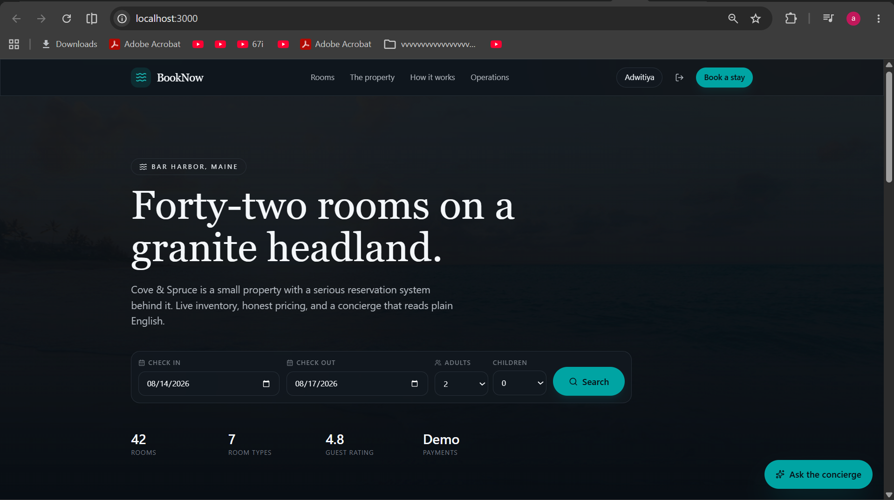
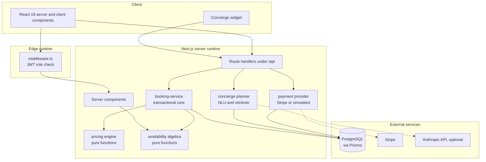
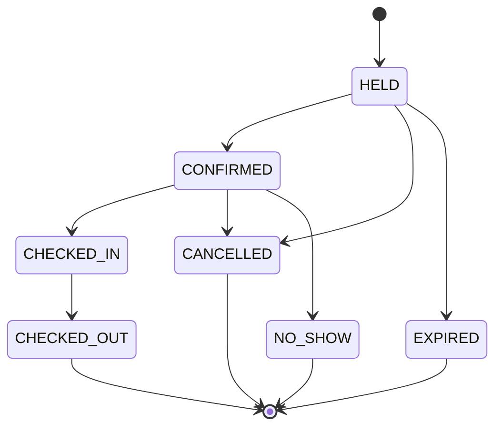

# BookNow

[](https://github.com/adwitiyashukla/booknow/actions/workflows/ci.yml)
[](LICENSE)

Resort reservation platform with a room-level availability engine, demand-based pricing, Stripe
payments, a retrieval-backed AI concierge, and a revenue-management dashboard. Built with
Next.js 15, TypeScript, PostgreSQL and Prisma.

Live demo: https://booknow-gold.vercel.app

Sign in as `admin@booknow.dev` / `Password123` for the operations dashboard, or
`guest@booknow.dev` / `Password123` for the guest view. Payments run in simulated mode, so a
booking can be completed end to end without a card.

| | |
| --- | --- |
|  |  |
| Search. Rates computed from occupancy for the requested dates. | Concierge. Natural language query, results retrieved from the database. |


Occupancy, ADR and RevPAR computed from a ledger of 7,112 reservations.



## Design problems and how they are handled

| Problem | Approach |
| --- | --- |
| Concurrent booking of the last room | Reservation written in a `Serializable` transaction that re-reads inventory inside the transaction. Postgres `40001` is caught and returned as `409`. |
| Same-day turnover | Stays are half-open intervals `[checkIn, checkOut)`, so checkout day and check-in day do not collide. |
| Abandoned checkouts holding inventory | Bookings enter `HELD` with a 15-minute expiry. Expiry is evaluated in the availability query, so a lapsed hold frees the room immediately. The cron sweep only updates the status column. |
| Floating-point money errors | All amounts are integer cents end to end. A test asserts no quote field is fractional. |
| Client-tampered prices | The server recomputes the price inside the booking transaction. The client quote is advisory. |
| Duplicate webhook deliveries | Settlement is idempotent, keyed on the Stripe event id. |
| LLM inventing rooms or prices | The concierge plans, retrieves, then answers from retrieved rows only. |

## Features

Guest:

- Date and occupancy search with per-night availability
- Room detail pages with a 45-night inventory strip
- Price quoting that re-runs on changes to dates, guests or rate plan
- Three rate plans per room with different cancellation rules
- Booking hold, checkout, confirmation, and cancellation with policy-driven refund
- Account with stay history and loyalty points

Concierge:

- Natural language query, for example "quiet sea-view room for 2 next weekend under $300"
- Two-tier planner: a deterministic rule-based NLU, upgraded to an LLM planner when
  `ANTHROPIC_API_KEY` is set. Both emit the same validated `StructuredQuery`.
- TF-IDF retriever with cosine similarity over database rows
- Scoring combines semantic similarity, soft preference matching and a review prior. Hard
  requirements and any stated price bound are applied as filters, not weighted terms.
- Each suggestion returns the reasons it matched

Operations:

- Revenue, occupancy, ADR, RevPAR, realisation and cancellation rate
- 30-day revenue trend and 45-night forward pickup
- Revenue by room type, booking status mix, lead time and length-of-stay averages
- Searchable booking ledger with per-reservation audit trail
- CSV export
- Restricted to `ADMIN` and `STAFF`, enforced in middleware and again in the admin layout

## Data

Two seed paths:

| Command | Ledger | Network |
| --- | --- | --- |
| `npm run db:seed` | Synthetic occupancy timeline, around 70% net occupancy | None |
| `npm run db:import:real` | ~40,000 reservations from a published dataset | One 40 MB download, cached |

Source dataset:

> Antonio, N., de Almeida, A., and Nunes, L. (2019). Hotel booking demand datasets.
> Data in Brief, 22, 41-49. 119,390 reservations from two Portuguese hotels, arrivals
> July 2015 to August 2017. Openly licensed.

Taken from the dataset: lead time, length of stay, party composition, cancellation and no-show
behaviour, average daily rate, arrival seasonality, market segment, distribution channel and
guest country of origin. The acquisition panels on the dashboard read directly from that ledger.

Adapted, because the source cannot supply it:

- Physical rooms. The dataset anonymises room types to letters and has no unit inventory. The
  importer replays the arrival stream against this property's 42 units in chronological order
  and rejects anything that does not fit, using the same half-open interval rule as the booking
  engine. Demand is allocated to tiers in proportion to their inventory, and each request takes
  the most recently vacated room (best-fit rather than first-fit).
- Calendar position. Arrivals are shifted forward as one block so the stream straddles the
  current date. Relative intervals are preserved; a unit test asserts this.
- Rates. Source rates are in euros. Each tier is rescaled by the ratio of its published base
  rate to the mean source rate for that tier, preserving relative dispersion and seasonality.
- Guest identity. The dataset is anonymised. Names are generated from a pool matched to each
  booking's country of origin.

The transformation lives in `src/lib/hotel-dataset.ts` as pure functions with 33 unit tests
against a fixture, so it can be verified without the 40 MB file.

## Architecture



### Booking lifecycle

The state machine is defined as data in `src/lib/booking-state.ts`. Tests assert every state is
reachable and that no cycle exists.



### Data model

Inventory is modelled at two levels:

- `RoomType` is the sellable product, carrying rate, photos and attributes
- `RoomUnit` is a physical room, which is what gets occupied

Availability is therefore a counting problem across a date range rather than a boolean flag. A
room type with ten units can sell ten simultaneous stays, and the binding constraint on a request
is the worst single night in the range.

## Pricing

`src/lib/pricing.ts` is pure: no database, no framework, and the clock is passed in as an
argument.

```
nightly rate = base
             x seasonal multiplier    (highest-priority rate rule wins)
             x weekend multiplier     (Friday and Saturday nights, 1.25)
             x demand multiplier      (0.92 to 1.60 across the occupancy curve)
             x lead-time multiplier   (0.88 to 1.00)

subtotal     = sum(nightly) + extra guests - length-of-stay discount + rate-plan adjustment
total        = subtotal + resort fee + service fee + occupancy tax
```

Each applied factor is returned with a label, so the booking page can show why a night costs what
it does. The stored `priceBreakdown` keeps past bookings auditable.

## Getting started

Requires Node 20+ and either Docker or a local PostgreSQL 14+.

```bash
git clone https://github.com/adwitiyashukla/booknow.git
cd booknow
npm install
cp .env.example .env

docker compose up -d db

npx prisma db push
npm run db:seed
npm run db:import:real
npm run dev
```

Open http://localhost:3000

### Demo accounts

| Email | Password | Access |
| --- | --- | --- |
| `admin@booknow.dev` | `Password123` | Operations dashboard |
| `staff@booknow.dev` | `Password123` | Front-desk view |
| `guest@booknow.dev` | `Password123` | Guest account and stay history |

### Running without API keys

Both external integrations degrade without configuration:

- Without `STRIPE_SECRET_KEY`, a simulated payment provider is used. It calls the same
  `settlePayment()` function as the Stripe webhook, including the idempotency guard.
- Without `ANTHROPIC_API_KEY`, the concierge uses its rule-based planner. Retrieval, ranking and
  grounding are unchanged; only query understanding differs.

## Commands

| Command | Description |
| --- | --- |
| `npm run dev` | Development server |
| `npm run build` | Generate the Prisma client and build for production |
| `npm run typecheck` | `tsc --noEmit` |
| `npm run test` | Vitest unit suite |
| `npm run test:coverage` | Coverage over `src/lib` |
| `npm run db:push` | Sync schema without a migration |
| `npm run db:migrate` | Create and apply a migration |
| `npm run db:seed` | Reset and reseed catalogue plus synthetic ledger |
| `npm run db:import:real` | Replace the ledger with the real dataset |
| `npm run db:studio` | Prisma Studio |

Both seed commands print the target database before writing, and refuse to run against a remote
host unless `ALLOW_REMOTE_SEED=true`.

## Tests

154 unit tests.

| Suite | Covers |
| --- | --- |
| `tests/pricing.test.ts` | Multiplier bounds and monotonicity, seasonal priority, weekend detection, integer-cent invariants, total reconciliation, refund policy |
| `tests/availability.test.ts` | Half-open interval overlap, same-day turnover, worst-night constraint, unit assignment without collisions, DST safety, lapsed holds releasing inventory |
| `tests/booking-state.test.ts` | Legal transitions, terminal states, reachability, acyclicity |
| `tests/nlu.test.ts` | Party size, relative and absolute dates, budget parsing, feature synonyms, hard and soft requirements, intent classification, malformed input |
| `tests/retriever.test.ts` | Tokenising and stemming, cosine edge cases, ranking, filter behaviour, score bounds |
| `tests/db-target.test.ts` | Postgres URL parsing without exposing the password, local and remote classification, failing safe on malformed input |
| `tests/hotel-dataset.test.ts` | CSV quoting, malformed rows, date shifting preserving intervals, capacity-weighted tiering, best-fit replay, rate rescaling |

```bash
npm run test
```

Several are property-based rather than example-based: the demand multiplier is monotonic across
the whole occupancy domain, no quote field is fractional, refund plus penalty equals the amount
paid, the same unit is never assigned twice for overlapping requests.

## Security

- Passwords hashed with bcrypt at cost 12. The sign-in path performs comparable work for unknown
  emails so response timing does not reveal which accounts exist.
- Role checks in `middleware.ts` and again in the admin layout
- Request bodies validated with Zod before reaching business logic
- Stripe webhooks verified against the signing secret
- Rate limiting on the booking, quote and concierge endpoints
- Security headers set in `next.config.ts`
- Prices recomputed server side inside the booking transaction

## Deployment

Vercel: connect the repository, set `DATABASE_URL` (Neon or Supabase both work on their free
tiers) and `AUTH_SECRET`. `vercel.json` registers a daily sweep of stale holds, which is the
maximum frequency the Hobby plan allows. Inventory remains correct between runs because expiry is
evaluated in the availability query. On a paid plan the schedule can be tightened to
`*/5 * * * *`.

Docker:

```bash
docker compose up --build
```

The runtime image uses the Next.js standalone output and runs as a non-root user.

## Layout

```
src/
  app/                 routes, server components, API handlers
  components/          UI components
  lib/                 pure domain logic (pricing, availability, state, NLU, retrieval)
  server/              database, auth, transactional services, payments, analytics
prisma/
  schema.prisma        data model
  seed.ts              synthetic ledger
  import-hotel-data.ts dataset importer
tests/                 vitest suites
docs/                  photography credits and screenshots
```

`src/lib` is pure and testable, `src/server` holds I/O. Nothing in `lib` imports Prisma.

## License

MIT
