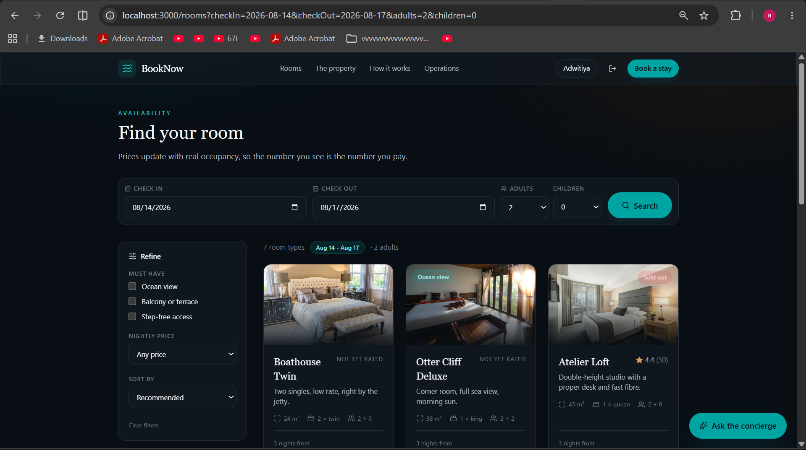
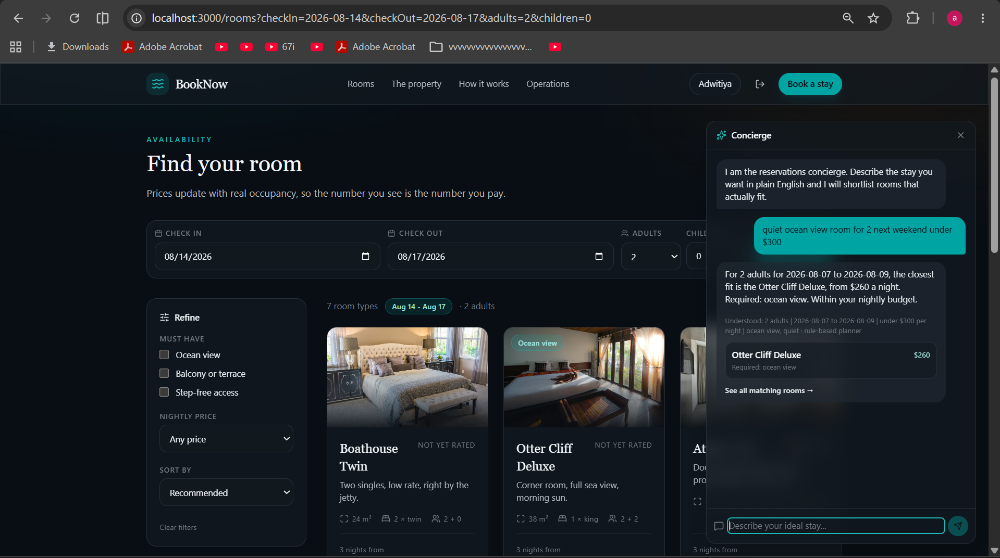
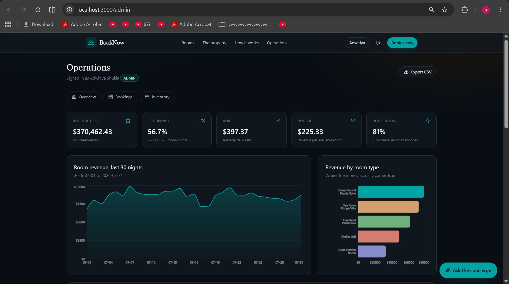
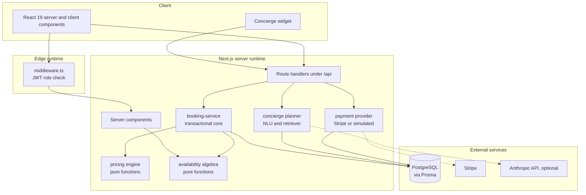
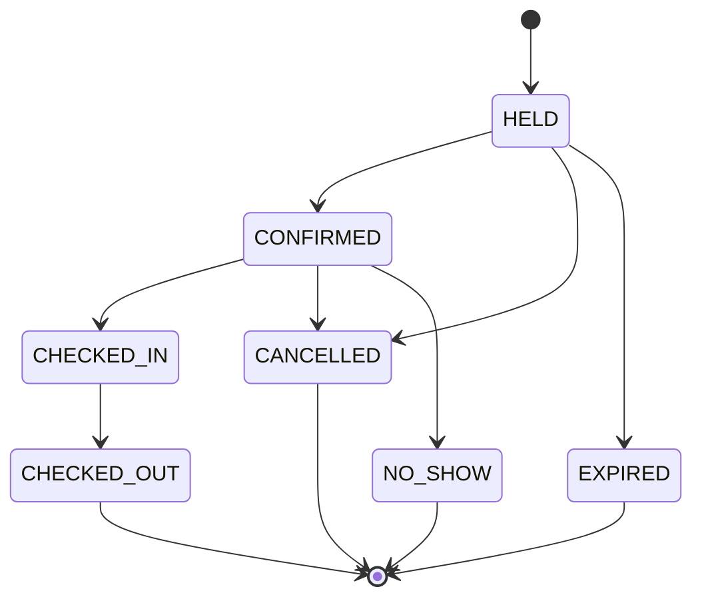

# BookNow

**A resort reservation platform with a real availability engine.**

Live inventory across physical room units, demand-based pricing, Stripe payments, an AI
concierge grounded in the database, and a revenue-management dashboard driven by **40,000 real
hotel reservations**. Built with Next.js 15, TypeScript, PostgreSQL, and Prisma.

| | |
| --- | --- |
|  |  |
| **Search.** Every rate is computed from real occupancy for those exact dates. | **Concierge.** Plain English in, real rows out, and a budget it actually respects. |



*Occupancy, ADR and RevPAR computed from a ledger of 7,112 real reservations.*

---

## Why this exists

Most booking demos store a boolean `isBooked` on a room and call it done. That model breaks the
moment two people book at once, or one guest checks out the same morning another checks in, or
you need a different price on a Saturday in December than a Tuesday in June.

This project takes the problems seriously:

| Problem | How it is solved here |
| --- | --- |
| Two guests race for the last room | Reservation is written in a `Serializable` transaction that re-reads inventory inside the transaction. Postgres `40001` is caught and returned as a clean `409`, not a `500`. |
| Same-day turnover | Stays are half-open intervals `[checkIn, checkOut)`, so checkout-day and check-in-day never collide. |
| Abandoned checkouts leak inventory | Bookings enter a `HELD` state with a 15-minute expiry. Expiry is evaluated **in the availability query**, so a lapsed hold frees the room immediately. The cron sweep only tidies the status column, it is not what correctness rests on. |
| Floating-point money bugs | Every amount is an integer number of cents, end to end. A test asserts no quote field is ever fractional. |
| Client-tampered prices | The server recomputes the authoritative price inside the booking transaction. The client quote is advisory only. |
| Duplicate webhook deliveries | Settlement is idempotent, keyed on the Stripe event id. Replaying an event is a no-op. |
| LLM hallucinating rooms and prices | The concierge plans, retrieves, then answers from retrieved rows. It can only name rooms that exist. |

---

## Feature tour

### Guest experience
- Date and occupancy search with live per-night availability
- Room detail pages with a 45-night inventory heat strip
- Real-time price quoting that re-runs as you change dates, guests, or rate plan
- Three rate plans per room (flexible, advance purchase, slow travel) with different
  cancellation rules
- Booking hold, checkout, confirmation, and self-service cancellation with a policy-driven refund
- Guest account with stay history and loyalty points

### AI concierge
- Ask in plain English: *"quiet sea-view room for 2 next weekend under $300"*
- Two-tier planner: a deterministic rule-based NLU that always works, upgraded to an LLM planner
  when `ANTHROPIC_API_KEY` is set. Both emit the same validated `StructuredQuery`.
- TF-IDF retriever with cosine similarity ranks real rows from Postgres
- Hybrid scoring: semantic similarity, soft preference boosting, and a quality prior, with
  hard requirements and any stated price bound applied as filters rather than weighted signals
- Every suggestion explains *why* it was suggested

### Operations dashboard
- Revenue, occupancy, **ADR**, **RevPAR**, conversion, and cancellation rate
- 30-day revenue trend and 45-night forward pickup curve
- Revenue split by room type, booking status mix, lead time and length-of-stay averages
- Searchable, filterable booking ledger with the full audit trail per reservation
- CSV export for finance
- Role-gated: `ADMIN` and `STAFF` only, enforced at the edge *and* in the layout

---

## The data is real

The dashboard is not driven by numbers I made up. There are two seeds:

| Command | Ledger | Network |
| --- | --- | --- |
| `npm run db:seed` | Synthetic occupancy timeline, tuned to roughly 70% net occupancy | None |
| `npm run db:import:real` | ~40,000 real reservations from a published dataset | One 40 MB download, cached |

The real source is:

> Antonio, N., de Almeida, A., & Nunes, L. (2019). *Hotel booking demand datasets.*
> **Data in Brief, 22, 41-49.** 119,390 real reservations from two Portuguese hotels,
> arrivals July 2015 to August 2017. Openly licensed.

**What is genuinely real:** lead time, length of stay, party composition, cancellation and
no-show behaviour, average daily rate, arrival seasonality, market segment, distribution
channel, and guest country of origin. The acquisition panels on the dashboard are read straight
off that ledger rather than estimated.

**What had to be adapted, and why:**

- *Physical rooms.* The dataset anonymises room types to letters and carries no unit inventory.
  So the importer **replays the real arrival stream against this property's 42 units in
  chronological order and turns away anything that will not fit** using the same half-open
  interval rule the live booking engine uses. That is not a workaround, it is what a real
  property does when it is full, and the importer reports how much business was refused.
  Demand is allocated to tiers in proportion to their inventory rather than split evenly, and
  each request takes the most recently vacated room (best-fit, not first-fit) so the calendar
  does not fill with short unsellable gaps. Both are what a front office actually does, and
  together they are worth roughly fifteen points of occupancy.
- *Calendar position.* Arrivals are shifted forward as one rigid block so the stream straddles
  today. Every interval, gap, and seasonal peak survives intact; a unit test asserts that.
- *Rates.* Source rates are in euros and would contradict the rates shown on the room pages, so
  each tier is rescaled by the ratio of its published base rate to the mean rate the source
  recorded for that tier. Relative dispersion and seasonality survive, the absolute level
  matches the catalogue.
- *Guest identity.* The dataset is anonymised, as it must be. Names are generated from a pool
  matched to each booking's real country of origin, so the distribution of source markets stays
  truthful even though the individuals are invented.

The whole transformation lives in `src/lib/hotel-dataset.ts` as pure functions with 28 unit
tests against a fixture, so none of it needs the 40 MB file to be verified.

---

## Architecture



### Booking lifecycle

The state machine lives in `src/lib/booking-state.ts` as data, not scattered conditionals. The
diagram below is generated from the same map the runtime enforces, and a test proves every state
is reachable and no cycle exists.



### Data model

Inventory is modelled at two levels, the way real property-management systems do it:

- **RoomType** is the sellable product (*Otter Cliff Deluxe*), carrying the rate, photos, and attributes
- **RoomUnit** is a physical room (*CO-301*), which is what actually gets occupied

Availability is therefore a *counting* problem across a date range, not a boolean flag. A room
type with ten units can sell ten simultaneous stays, and the binding constraint on any request is
the single worst night in the range.

---

## Pricing engine

`src/lib/pricing.ts` is pure: no database, no framework, no clock it does not accept as an
argument. That is what makes it testable.

```
nightly rate = base
             x seasonal multiplier    (highest-priority rate rule wins)
             x weekend multiplier     (Friday and Saturday nights, 1.25)
             x demand multiplier      (0.92 to 1.60 across the occupancy curve)
             x lead-time multiplier   (0.88 to 1.00, bounded both ways)

subtotal     = sum(nightly) + extra guests - length-of-stay discount + rate-plan adjustment
total        = subtotal + resort fee + service fee + occupancy tax
```

Every applied factor is returned with a human-readable label, so the booking page can show the
guest exactly why a night costs what it costs, and the stored `priceBreakdown` makes any past
booking auditable.

---

## Getting started

### Prerequisites
Node 20+, and either Docker or a local PostgreSQL 14+.

### Quick start

```bash
git clone https://github.com/<your-username>/booknow.git
cd booknow
npm install
cp .env.example .env          # the defaults work out of the box

docker compose up -d db       # or point DATABASE_URL at your own Postgres

npx prisma db push            # create the schema
npm run db:seed               # catalogue + synthetic ledger, deterministic
npm run db:import:real        # optional: swap in ~40k real reservations
npm run dev
```

Open <http://localhost:3000>.

### Demo accounts

| Email | Password | Sees |
| --- | --- | --- |
| `admin@booknow.dev` | `Password123` | Full operations dashboard |
| `staff@booknow.dev` | `Password123` | Front-desk view |
| `guest@booknow.dev` | `Password123` | Guest account and stay history |

### Running without any API keys

Both external integrations degrade gracefully, on purpose:

- **No `STRIPE_SECRET_KEY`** → a built-in simulated payment provider takes over. It calls the
  *same* `settlePayment()` function the real Stripe webhook calls, including the idempotency
  guard, so the booking lifecycle is genuinely exercised rather than faked.
- **No `ANTHROPIC_API_KEY`** → the concierge uses its deterministic rule-based planner. Ranking,
  retrieval, and grounding are identical; only the query-understanding tier changes.

Clone and run: everything works.

---

## Commands

| Command | What it does |
| --- | --- |
| `npm run dev` | Development server |
| `npm run build` | Generate the Prisma client and build for production |
| `npm run typecheck` | `tsc --noEmit` in strict mode |
| `npm run test` | Vitest unit suite |
| `npm run test:coverage` | Coverage report over `src/lib` |
| `npm run db:push` | Sync the schema without a migration |
| `npm run db:migrate` | Create and apply a migration |
| `npm run db:seed` | Reset and reseed the catalogue plus a synthetic ledger |
| `npm run db:import:real` | Swap the ledger for ~40k real reservations |
| `npm run db:studio` | Prisma Studio |

---

## Testing

143 unit tests across the five subsystems where correctness actually matters:

| Suite | Covers |
| --- | --- |
| `tests/pricing.test.ts` | Multiplier monotonicity and bounds, seasonal priority resolution, weekend detection, integer-cents invariants, total reconciliation, refund policy |
| `tests/availability.test.ts` | Half-open interval overlap, same-day turnover, worst-night binding constraint, unit assignment without collisions, DST safety, lapsed holds releasing inventory without a sweeper |
| `tests/booking-state.test.ts` | Legal transitions, terminal-state immutability, reachability, acyclicity |
| `tests/nlu.test.ts` | Party size, relative and absolute dates, budget parsing, feature synonyms, hard vs soft requirements, intent classification, hostile input |
| `tests/retriever.test.ts` | Tokenising and stemming, cosine edge cases, ranking correctness, hard-filter behaviour, score bounds |
| `tests/hotel-dataset.test.ts` | CSV quoting, malformed and complimentary rows, date shifting preserves every gap and stay length, capacity-weighted tiering, best-fit inventory replay with deterministic tie-breaking, rate rescaling |

```bash
npm run test
```

Several are property-style rather than example-based: *"the multiplier is monotonic across the
whole occupancy domain"*, *"no quote field is ever fractional"*, *"refund plus penalty always
equals the amount paid"*, *"the same unit is never assigned twice for overlapping requests"*,
*"shifting the dataset forward preserves every interval between arrivals"*.

---

## Security notes

- Passwords hashed with bcrypt at cost 12; the sign-in path does comparable work for unknown
  emails so response timing does not leak which accounts exist
- Role checks at the edge (`middleware.ts`) *and* again in the admin layout, so no render path
  can leak data
- Every request body validated with Zod before it reaches business logic
- Stripe webhooks verified against the signing secret; unsigned requests are rejected
- Rate limiting on the booking, quote, and concierge endpoints
- Security headers set in `next.config.ts`
- Prices always recomputed server side inside the booking transaction

---

## Deployment

**Vercel** (recommended): connect the repo, add `DATABASE_URL` (Neon or Supabase both work on the
free tier) and `AUTH_SECRET`, and deploy. `vercel.json` registers a daily sweep of stale holds,
which is all the Hobby plan allows. That is deliberately fine: expiry is evaluated inside the
availability query, so inventory is correct between runs and the sweep is only housekeeping. On a
paid plan, tighten the schedule to `*/5 * * * *`.

**Docker**:

```bash
docker compose up --build
```

The runtime image uses the Next.js standalone output and runs as a non-root user.

---

## Project layout

```
src/
  app/                 routes, server components, API handlers
  components/          UI, all typed, no component library
  lib/                 pure domain logic (pricing, availability, state, NLU, retrieval)
  server/              database, auth, transactional services, payments, analytics
prisma/
  schema.prisma        the data model
  seed.ts              deterministic synthetic ledger
  import-hotel-data.ts real-dataset importer
tests/                 vitest unit suites
docs/                  architecture decision records
```

The `src/lib` and `src/server` split is deliberate: `lib` is pure and testable, `server` is where
I/O lives. Nothing in `lib` imports Prisma.

---

## Licence

MIT
